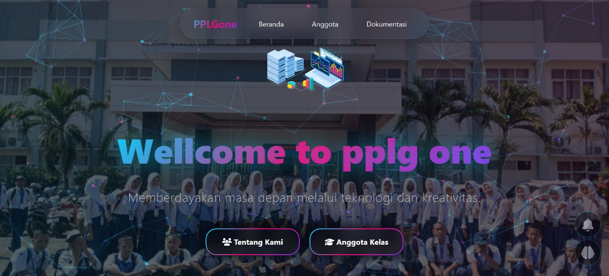

# 📘 pplgoneclass

<div align="center">

[](https://developer.mozilla.org/en-US/docs/Web/HTML)
[](https://developer.mozilla.org/en-US/docs/Web/CSS)
[](https://developer.mozilla.org/en-US/docs/Web/JavaScript)
[](https://vercel.com)

**Website resmi kelas XI PPLG 1 SMKN 1 Kragilan** 🎓 
*Membangun identitas digital, menyatukan kreativitas dalam kode*

[🚀 Live Demo](https://oneclass.vercel.app) • [📖 Documentation](#-dokumentasi) • [🤝 Contributing](#-kontribusi) • [📧 Contact](#-kontak)

</div>

---

## ✨ Tentang Proyek

**pplgoneclass** adalah platform digital yang menghubungkan siswa-siswi kelas **XI PPLG 1 SMKN 1 Kragilan** dalam satu wadah dokumentasi, publikasi informasi, dan showcase karya. Lebih dari sekadar website, ini adalah representasi digital dari semangat kolaborasi dan kreativitas anak-anak PPLG!

<div align="center">

### 🎯 **Visi & Misi**
*"Menciptakan ekosistem digital yang memperkuat identitas kelas dan mengasah kemampuan programming siswa"*

</div>

---

## 🚀 Fitur Unggulan

<table>
<tr>
<td width="50%">

### 🏠 **Home Page**
- Profil kelas yang menarik
- Tujuan dan visi-misi
- Statistik kelas real-time
- Hero section yang eye-catching

### 📸 **Gallery**
- Dokumentasi kegiatan kelas
- Showcase project siswa
- Image lazy loading
- Lightbox gallery view

</td>
<td width="50%">

### 👥 **Members Directory**
- Database lengkap anggota kelas
- Profil individual siswa
- Social media integration
- Search & filter functionality

### 📱 **Responsive Design**
- Mobile-first approach
- Desktop optimization warning
- Cross-browser compatibility
- Progressive Web App ready

</td>
</tr>
</table>

---

## 🛠️ Tech Stack

<div align="center">

| Frontend | Hosting | Tools |
|----------|---------|--------|
|  |  |  |
|  |  |  |
|  | |  |

</div>

---

## 📁 Struktur Proyek

```
pplgoneclass/
├── 🏠 index.html              # Landing page utama
├── 📂 Ex/                     # Halaman ekstensi
│   ├── 🏠 home.html          # Halaman home
│   ├── 📸 gallery.html       # Galeri foto & karya
│   ├── 👥 members.html       # Daftar anggota kelas
│   └── 📂 app/               # Assets aplikasi
│       ├── 🎨 stylenav.css   # Style navigasi
│       ├── ⚡ scriptnav.js   # Script navigasi
│       ├── 📂 css/           # Custom stylesheets
│       └── 📂 js/            # JavaScript modules
└── 📂 component/             # Komponen reusable
```

---

## 🚀 Quick Start

### Prerequisites
- Browser modern (Chrome, Firefox, Safari, Edge)
- Git (untuk development)
- Text editor (VSCode recommended)

### Installation

```bash
# Clone repository
git clone https://github.com/AibyIlannn/pplgoneclass.git

# Masuk ke direktori
cd pplgoneclass

# Buka di browser atau live server
# Option 1: Double click index.html
# Option 2: Live Server di VSCode (Ctrl+Shift+P > Live Server)
# Option 3: Python HTTP server
python -m http.server 8000
```

### 🌟 Live Demo
Akses langsung di: **[oneclass.vercel.app](https://oneclass.vercel.app)**

---

## 📊 Project Stats

<div align="center">


</div>

---

## 👨‍💻 Developer & Team

<div align="center">


**Ilan Al Iman**  
*Lead Developer & Project Manager*

[](https://github.com/AibyIlannn)
[](https://instagram.com/ainominal.co)

**Tim XI PPLG 1** • **SMKN 1 Kragilan**

</div>

---

## 🎯 Roadmap & Future Features

- [ ] 🔐 **Authentication System** - Login untuk anggota kelas
- [ ] 📝 **Blog Section** - Artikel dan tutorial dari siswa
- [ ] 🏆 **Achievement Board** - Hall of fame prestasi kelas
- [ ] 💬 **Comment System** - Interaksi di gallery dan project
- [ ] 📱 **PWA Support** - Install di mobile device
- [ ] 🌙 **Dark Mode** - Theme switching
- [ ] 🔍 **Advanced Search** - Filter dan pencarian konten
- [ ] 📊 **Analytics Dashboard** - Statistik website

---

## 🤝 Kontribusi

Kami sangat welcome untuk kontribusi dari teman-teman! 🎉

### How to Contribute:
1. **Fork** repository ini
2. **Create** branch untuk feature baru (`git checkout -b feature/AmazingFeature`)
3. **Commit** perubahan (`git commit -m 'Add some AmazingFeature'`)
4. **Push** ke branch (`git push origin feature/AmazingFeature`)
5. **Open** Pull Request

### Contribution Guidelines:
- Ikuti coding style yang ada
- Test di berbagai browser
- Update dokumentasi jika perlu
- Diskusikan major changes di Issues

---

## 📸 Screenshots

<div align="center">

### 🖥️ Desktop View


### 📱 Mobile View


</div>

---

## 📄 License

<div align="center">


Proyek ini dibuat untuk **tujuan pendidikan** dan dokumentasi internal kelas.  
Semua hak cipta mengikuti aturan developer utama.

</div>

---

## 📧 Kontak & Support

<div align="center">

Punya pertanyaan? Saran? Atau mau join tim development? 

[](mailto:your-email@example.com)
[](https://wa.me/your-number)
[](https://instagram.com/ainominal.co)

**Made with ❤️ by XI PPLG 1 SMKN 1 Kragilan**

</div>

---

<div align="center">

### ⭐ Jangan lupa kasih **star** kalau project ini bermanfaat!


</div># oneclass
# 20989182
